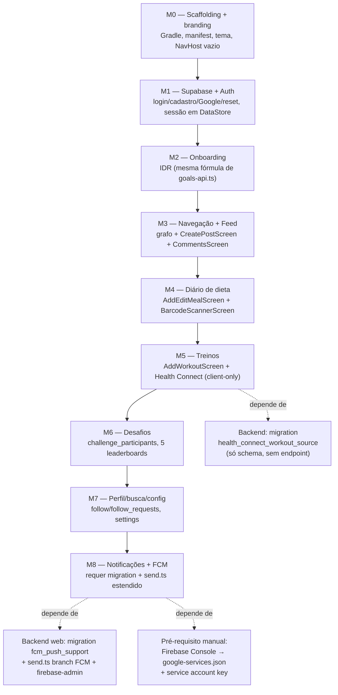

# Plano: versão nativa em Kotlin do LajesFit

## Contexto

O LajesFit hoje é um app web (React + TanStack Start + Supabase) distribuído no Android apenas como **TWA** (`android-twa/`, Java/Bubblewrap) — a PWA embrulhada numa casca fina, não um app nativo de verdade. O pedido é uma versão **nativa em Kotlin**, rodando lado a lado com a TWA (novo package ID) até decidir substituí-la.

Decisões confirmadas com o usuário:
1. Novo projeto em `android/` neste mesmo repositório (monorepo), ao lado de `android-twa/` (intocado por ora). Não há nenhum arquivo Gradle na raiz do repo hoje nem CI configurado (`.github/workflows` não existe) — colocar `android/` lá não colide com nada.
2. Package ID novo: `com.lajesfit.android` (a TWA usa `com.lajesfit.app`, confirmado em `android-twa/twa-manifest.json`).
3. Escopo da fase 1: base ampla — setup + auth/onboarding + esqueleto funcional de todas as telas principais, não um vertical slice profundo.
4. Push entra agora via Firebase Cloud Messaging, com as mudanças de schema/backend necessárias (hoje é só Web Push/VAPID, que só funciona em navegador).

O app compartilha o **mesmo projeto Supabase** do app web — mesmo banco, mesmas RLS, mesmo bucket `media`. Não é um backend novo, é um novo cliente do backend existente.

Toda a arquitetura abaixo (bibliotecas, estrutura de pastas, telas por marco) foi validada lendo o código real do web app. Duas mudanças de fundo em relação ao rascunho original:
- **Sem integração com Strava no app Android** — decisão explícita do usuário. Em vez de replicar o OAuth do Strava (que exigiria 2 endpoints novos no backend web, client secret, callback custom scheme), o app nativo integra com **Health Connect**, a API de dados de saúde/fitness do próprio Android — client-only, sem backend novo. Ver seção dedicada abaixo. O Strava continua existindo só no app web (`android-twa`/PWA), intocado.
- Estratégia de execução em marcos pequenos e resumíveis (ver seção **Estratégia de execução**), para que perder uma sessão do Claude Code no meio de um marco não deixe o repositório num estado quebrado.

## Arquitetura

- **Kotlin + Jetpack Compose (Material 3)**, Gradle single-module (`:app`). O app tem ~9 áreas de feature mas nada indica que multi-módulo compense agora; revisitar só se o build ou a organização do time exigir.
- **MVVM, single-Activity**: `ViewModel` + `StateFlow` por tela. `MainActivity` é a **única Activity do app** (padrão idiomático do Compose) e hospeda um único `NavHost` (Navigation Compose) com todos os destinos — os 5 principais da bottom-nav (Feed / Dieta / **Novo** / Treinos / Desafio, espelhando `src/components/app-shell.tsx:128-234`) e também as telas de formulário/"pop over", como destinos comuns do mesmo grafo. Ver subseção dedicada abaixo.
- **Otimizado para celular** (decisão do usuário): orientação retrato fixa (`android:screenOrientation="portrait"`, já é a mesma orientação declarada em `public/manifest.webmanifest`'s `orientation: portrait-primary`), sem layout adaptativo para tablet/foldable/janela grande nesta fase.
- **supabase-kt** (`io.github.jan-tennert.supabase`) para Auth, Postgrest, Storage, Realtime — mesmo projeto Supabase, mesmas RLS.
- **Ktor client (engine OkHttp)** como único stack de rede (supabase-kt já usa Ktor por baixo; não introduzir Retrofit como segunda lib).
- **Hilt** (DI), **Coil** (imagens), **ML Kit Barcode Scanning + CameraX** (equivalente nativo do `window.BarcodeDetector` usado em `src/features/diet/BarcodeScannerDialog.tsx`, que já tem fallback de busca manual e Open Food Facts — replicar essa cadeia: detectar → `lookupOpenFoodFactsByBarcode`-equivalente), **Firebase Cloud Messaging** (push), **Health Connect** (`androidx.health.connect:connect-client`, leitura de treinos gravados por outros apps — ver seção dedicada; substitui a integração com Strava nesta versão nativa), **DataStore** (estado local leve — Android já resolve com `ViewModel`/`SavedStateHandle` o que o web faz via os hacks descritos abaixo).
- **Identidade visual**: `#E76F2E` / `#FFF8EC` (confirmado em `public/manifest.webmanifest` e `android-twa/twa-manifest.json`), ícone a partir de `public/icon-512.png` (existe, 512×512).

### Telas "pop over" → destinos do mesmo `NavHost` (single-Activity — decisão revisada)

Decisão revertida pelo usuário: **não** viram Activities separadas — ficam como destinos comuns do único `NavHost` da `MainActivity`, que é o padrão idiomático do Compose hoje. No web, essas telas são modais renderizados sobre a tela de trás (confirmado por arquivo, `src/features/**/*Dialog.tsx`):
- `AddFoodDialog.tsx` (adicionar/editar item de refeição) → **`AddEditMealScreen`**, rota `"meal/add?groupId={groupId}"` / `"meal/edit/{entryId}"` (M4).
- `ManualWorkoutDialog.tsx` (adicionar treino manual) → **`AddWorkoutScreen`**, rota `"workout/add"` (M5).
- `CreatePostDialog.tsx` (criar post) → **`CreatePostScreen`**, rota `"post/create"` (M3).
- `CommentsDialog.tsx` (comentários de um post) → **`CommentsScreen`**, rota `"post/{postId}/comments"` (M3).
- `BarcodeScannerDialog.tsx` (scanner full-screen) → **`BarcodeScannerScreen`**, rota `"diet/scanner"`, navegada a partir de `AddEditMealScreen` (M4).

Mecânica (idiomática de Navigation Compose, sem `Intent`/`ActivityResultContracts`):
- Navegação com `navController.navigate(route)`; volta com `navController.popBackStack()`.
- Resultado de volta para a tela anterior via `NavBackStackEntry.savedStateHandle` (`currentBackStackEntry?.savedStateHandle?.set("result", value)` antes do `popBackStack()`; a tela chamadora observa com `savedStateHandle?.getStateFlow(...)` no seu próprio `NavBackStackEntry`) — esse é o mecanismo documentado do Navigation Compose para passar resultado entre destinos, e substitui o par `NEW_ACTION_EVENT`/`CHANGE_EVENT` que o web usa hoje só por não ter cache reativo de verdade.
- Argumentos de entrada (ex.: `mealId`/`groupId`, `postId`) via argumentos de rota (`navArgument`), análogo às props passadas hoje para o componente de diálogo.
- Transição de entrada/saída deslizando de baixo para cima definida no próprio destino (`composable(route, enterTransition = { slideInVertically(...) }, exitTransition = { slideOutVertically(...) })`) — preserva a sensação de "pop over" do Dialog do web sem precisar de uma Activity separada.
- `ViewModel` obtido com `hiltViewModel()` escopado à entrada de navegação; o `SavedStateHandle` desse ViewModel já sobrevive a rotação/morte de processo, sem precisar do hack de `sessionStorage` que o web usa (ver abaixo).
- `NotificationsSheet.tsx` segue o mesmo raciocínio dos demais agora que tudo é single-Activity: bottom sheet Compose sobre o `NavHost`, sem necessidade de virar uma rota própria.

**Exceção não relacionada a essa decisão**: a Activity de "rationale" de permissão de saúde exigida pela Play Store para o Health Connect (seção Health Connect, M5) continua sendo uma Activity de verdade — isso é exigência da própria plataforma (`intent-filter` para `androidx.health.ACTION_SHOW_PERMISSIONS_RATIONALE`), não uma escolha de arquitetura de navegação, e não pode ser um destino de `NavHost`.

### O que NÃO portar literalmente

Dois mecanismos do web existem só para compensar a falta de gerência de estado real e a morte de processo do PWA — não replicar em Android, que resolve isso nativamente com `ViewModel`/`SavedStateHandle` + `StateFlow`:
- `src/lib/session-draft.ts`: rascunhos de formulário em `sessionStorage` com envelope versionado + TTL, usados por `AddFoodDialog` (`lajesfit-meal-draft`), `ManualWorkoutDialog` (`lajesfit-workout-draft`) e `CreatePostDialog` (`lajesfit-post-draft`).
- `src/features/fitness/change-event.ts` (evento global `CHANGE_EVENT` = `"lajesfit-backend-change"`): re-sync manual entre abas/telas porque não há TanStack Query nem cache reativo real.

### Estrutura de pastas (`android/`)

```
android/
├── settings.gradle.kts, build.gradle.kts, gradle/libs.versions.toml
└── app/
    ├── build.gradle.kts            (applicationId "com.lajesfit.android")
    ├── google-services.json        (NÃO versionado — usuário adiciona via Firebase Console)
    └── src/main/kotlin/com/lajesfit/android/
        ├── LajesFitApp.kt, MainActivity.kt      (única Activity do app; hospeda o NavHost inteiro)
        ├── core/{di, supabase, network, data, util}
        ├── navigation/{LajesFitNavGraph.kt, Destinations.kt}
        ├── ui/theme/
        └── feature/
            ├── feed/{FeedScreen.kt, CreatePostScreen.kt, CommentsScreen.kt, ...}
            ├── diet/{DietScreen.kt, AddEditMealScreen.kt, BarcodeScannerScreen.kt, ...}
            ├── workouts/{WorkoutsScreen.kt, AddWorkoutScreen.kt, HealthConnectSync.kt, HealthPermissionRationaleActivity.kt, ...}
            └── {auth, onboarding, challenges, profile, settings, notifications}/
```

Cada pasta em `feature/` espelha `src/features/*` do web para facilitar comparação de paridade. As telas "pop over" (seção acima) moram dentro da pasta do feature a que pertencem, como destinos do `NavHost`, não como Activities — a única exceção é `HealthPermissionRationaleActivity.kt` (exigência da Play Store, ver seção Health Connect).

## Health Connect (substitui Strava no app Android — sem backend novo)

Decisão do usuário: o app Android **não implementa vínculo com Strava**. Em vez de replicar o fluxo OAuth do Strava (que exigiria os 2 endpoints, o client secret e o redirect customizado descritos numa versão anterior deste plano), os treinos automáticos vêm do **Health Connect** — o repositório de dados de saúde/fitness do próprio Android (`androidx.health.connect:connect-client`), que agrega dados gravados por outros apps no aparelho (Google Fit, Samsung Health, o próprio app Strava se o usuário o tiver instalado e configurado para escrever no Health Connect, relógios, etc.). Isso é **inteiramente client-side**: sem OAuth, sem secret, sem endpoint novo no backend web — o app lê do Health Connect local e grava direto em `workouts` via Postgrest, do mesmo jeito que um treino manual.

- **Schema atual de `workouts`** (confirmado em `supabase/migrations/20260612021259_...sql:120-136` + `20260619113000_add_strava_import_support.sql`): `source public.workout_source NOT NULL DEFAULT 'manual'` com `CREATE TYPE workout_source AS ENUM ('manual', 'strava')`, e `strava_activity_id BIGINT UNIQUE` como chave de deduplicação para importação automática. O padrão para Health Connect é o mesmo, generalizado: nova migration `supabase/migrations/20260720120000_health_connect_workout_source.sql` com `ALTER TYPE public.workout_source ADD VALUE 'health_connect'` e `ALTER TABLE public.workouts ADD COLUMN health_connect_record_id TEXT UNIQUE` (Health Connect usa IDs de registro em formato string/UUID, não bigint — por isso `TEXT`, não `BIGINT` como o do Strava). RLS de `workouts` já cobre `INSERT`/`UPDATE` por `auth.uid() = user_id` (`20260612021259_...sql:141-142`), não precisa mudar.
- **Fluxo no app**: checar se o Health Connect está instalado (`HealthConnectClient.getSdkStatus`) — se não, redirecionar para a Play Store; pedir permissão de leitura via `PermissionController.createRequestPermissionResultContract()` para `HealthPermission.getReadPermission(ExerciseSessionRecord::class)` (+ permissões de agregação de distância/calorias/frequência cardíaca conforme necessário); ler `ExerciseSessionRecord`s num intervalo de tempo com `healthConnectClient.readRecords(...)`; para cada sessão, agregar distância/calorias/duração com `aggregate()` no intervalo da sessão; mapear `exerciseType` (constantes `EXERCISE_TYPE_RUNNING`, `EXERCISE_TYPE_WALKING`, `EXERCISE_TYPE_BIKING`, `EXERCISE_TYPE_STRENGTH_TRAINING`, `EXERCISE_TYPE_HIKING`, `EXERCISE_TYPE_SWIMMING_POOL`/`_OPEN_WATER`, etc.) para as mesmas 7 categorias em português já usadas no app (`Corrida`, `Caminhada`, `Ciclismo`, `Musculacao`, `Trilha`, `Natacao`, `Outro` — confirmado em `src/features/workouts/ManualWorkoutDialog.tsx:30` e no `ACTIVITY_TYPE_MAP` de `strava.server.ts:39-53`, que já faz esse mesmo tipo de mapeamento para o Strava); upsert em `workouts` com `source='health_connect'`, `health_connect_record_id=record.metadata.id` (o `UNIQUE` cuida da deduplicação — reimportar não duplica).
- **Sincronização**: botão manual "Sincronizar com Health Connect" na tela de Treinos (equivalente ao "Conectar Strava" que existiria na versão anterior do plano) — sem webhook, sem sync em background nesta fase 1 (fica pro roadmap).
- **Requisito de Play Store para permissões de saúde**: apps que pedem `HealthPermission` precisam declarar uma tela de "rationale" (`AndroidManifest.xml` com `intent-filter` para `androidx.health.ACTION_SHOW_PERMISSIONS_RATIONALE` + uma Activity simples explicando o uso) — sem isso a app é rejeitada na revisão de permissões sensíveis. Incluir essa Activity no M5, mesmo que o app não vá à loja imediatamente.
- **Fora do escopo desta fase**: escrever dados de volta no Health Connect (só leitura), sincronização automática em background (`WorkManager`), qualquer coisa relacionada a Strava no app Android.

## Push notifications (FCM) — mudanças de backend

Schema atual confirmado em `supabase/migrations/20260718120000_push_notifications.sql:16-29`: `push_subscriptions(id, user_id, endpoint NOT NULL UNIQUE, p256dh NOT NULL, auth NOT NULL, created_at)`, sem coluna de plataforma. `request_push_delivery()` (linhas 154-167) dispara em todo insert de `notifications` cujo `type` esteja em `('like','comment','follow','challenge_dethroned')` e chama `POST /api/push/send` com `{notificationId}` — agnóstico de como a entrega acontece, **não precisa mudar**.

Nova migration `supabase/migrations/20260720120000_fcm_push_support.sql` (próxima após `20260719120000_notification_preferences.sql`, a mais recente hoje):
- `CREATE TYPE push_platform AS ENUM ('web','android')`; nova coluna `platform` (default `'web'`, backfill correto pois toda linha hoje é web); relaxar `endpoint`/`p256dh`/`auth` para NULL; nova coluna `fcm_token TEXT UNIQUE`; `CHECK` garantindo que linhas `web` tenham os 3 campos web e `android` tenha `fcm_token`. RLS (`auth.uid() = user_id`) já é agnóstica de plataforma, não muda.
- `src/routes/api/push/send.ts` (hoje só web-push, linhas 113-149) é **estendido**, não duplicado em rota separada — preserva o "claim" atômico via `pushed_at` (linhas 84-97) que já existe. A query de `push_subscriptions` passa a trazer `platform`/`fcm_token`; branch por assinatura — `web` mantém `web-push` como está, `android` usa novo helper com `firebase-admin` (`getMessaging().send(...)`), enviando **data-only message** (sem `notification:` payload) para controlar exibição/deep-link no `onMessageReceived` mesmo em background. Poda de tokens mortos ganha os códigos de erro do FCM (`messaging/registration-token-not-registered` etc.), mesma lógica de hoje (404/410 do web-push, linhas 138-149).
- Nova dependência no `package.json` do web: `firebase-admin`. Novas env vars no Vercel: `FIREBASE_PROJECT_ID`, `FIREBASE_CLIENT_EMAIL`, `FIREBASE_PRIVATE_KEY` (ou `FIREBASE_SERVICE_ACCOUNT_JSON`).

**Pré-requisito manual e externo, sem substituto em código**: usuário cria projeto no Firebase Console, registra o app Android sob `com.lajesfit.android` (gera `google-services.json` para `android/app/`), gera service account key para as env vars do servidor. Bloqueia só o marco M8 — nenhum marco anterior depende disso.

## Sequência de implementação



Cada marco abaixo é pensado para ser uma unidade de trabalho independente — ver **Estratégia de execução** logo a seguir para como isso se traduz em sessões/commits/PRs.

- **M0 — Scaffolding e branding**: `settings.gradle.kts`, `libs.versions.toml`, `app/build.gradle.kts` (`applicationId "com.lajesfit.android"`, `screenOrientation="portrait"`), `AndroidManifest.xml`, tema/cores (`#E76F2E`/`#FFF8EC`), ícones adaptativos a partir de `public/icon-512.png`, `MainActivity.kt` com `NavHost` e as 5 destinations vazias + FAB central (o FAB só lança as Activities novas quando o marco correspondente existir; até lá aponta pra tela vazia). **Feito quando**: app builda, abre no emulador mostrando os 5 destinos vazios com bottom-nav e cores da marca.
- **M1 — Supabase + Auth**: `SupabaseClient` via Hilt (auth-kt/postgrest-kt/storage-kt, sessão em DataStore); login usuário-ou-email espelhando a RPC `get_login_email` (`src/features/auth/auth.ts:73-75,93-95`), cadastro, Google OAuth (Credential Manager, plugin `compose-auth`), esqueci-a-senha, tela de exigir-email para contas legadas (`LEGACY_EMAIL_DOMAIN`, ver `app-shell.tsx:91-93`). **Feito quando**: criar conta, logar com usuário ou email, logar com Google, resetar senha, sessão sobrevive a restart.
- **M2 — Onboarding**: equivalente a `/setup` — formulário sexo/idade/peso/altura/atividade, fórmula de Harris-Benedict + fator de atividade idêntica a `calculateIdr` (`src/features/goals/goals-api.ts:60-67`), grava `profiles.calorie_goal`/`goal_*` via update direto (não é RPC), bloqueia navegação até completar. **Feito quando**: completar o formulário grava o perfil e libera a navegação; reabrir o app não pede onboarding de novo.
- **M3 — Navegação + Feed**: grafo completo (5 destinos); feed paginado via RPC `get_feed_post_ids` (`feed-api.ts:131-136`), curtir, apagar post próprio; **`CreatePostScreen`** e **`CommentsScreen`** (destinos do mesmo `NavHost`, ver seção "Telas pop over") em versão básica (texto simples aceitável nesta fase). **Feito quando**: navegar entre as 5 abas funciona, feed carrega posts reais paginados, curtir/criar post/comentar/apagar funcionam de ponta a ponta contra o Supabase real.
- **M4 — Diário de dieta**: dia atual sobre `diet_meals`/`diet_entries` (stepper dia-a-dia no lugar de calendário completo), **`AddEditMealScreen`** com busca de alimento via RPC `search_foods` (`food-catalog.ts:375-378`) + registro manual via `upsert_catalog_food` (`food-catalog.ts:562-567`), **`BarcodeScannerScreen`** (ML Kit) + fallback Open Food Facts funcionando de verdade (mesmo fluxo de `BarcodeScannerDialog.tsx`: detectar → `lookupOpenFoodFactsByBarcode` → erro com opção de digitar manualmente), devolvendo o alimento encontrado para `AddEditMealScreen` via `NavBackStackEntry.savedStateHandle`. **Feito quando**: registrar uma refeição (buscada ou escaneada) grava em `diet_entries` e aparece no diário do dia.
- **M5 — Treinos**: histórico + estatísticas básicas, **`AddWorkoutScreen`** para treino manual com foto (bucket `media`, path `${userId}/workouts/${timestamp}-${nome}`, mesmo padrão de `workouts-api.ts:42-54`), sincronização com Health Connect (ver seção dedicada) + a `HealthPermissionRationaleActivity` (única Activity extra do app, exigida pela Play Store). **Feito quando**: criar treino manual com foto salva em `workouts` e aparece no histórico; conceder permissão do Health Connect e sincronizar importa sessões de exercício reais do dispositivo sem duplicar (testável reimportando duas vezes).
- **M6 — Desafios**: card do desafio atual, entrar (`challenge_participants`), as 5 leaderboards como listas simples (pódio visual fica para depois). **Feito quando**: entrar no desafio grava a participação e as 5 leaderboards mostram dados reais e coerentes com o web.
- **M7 — Perfil, busca e configurações**: perfil (stats, grid de posts), seguir/pedir-para-seguir (`is_private`/`follow_requests`, espelhando `follows-api.ts`), busca de usuários, configurações (editar perfil/avatar, privacidade, preferências de notificação por tipo, trocar/definir senha, sair). **Feito quando**: seguir/pedir-seguir funciona para perfil público e privado, editar perfil e trocar senha persistem no Supabase.
- **M8 — Notificações + FCM**: lista de notificações com marcar-todas-lidas; `LajesFitMessagingService` (extends `FirebaseMessagingService`) tratando `onNewToken`/`onMessageReceived` e deep-link ao tocar; registro do token via upsert direto em `push_subscriptions`; PR inclui as mudanças de backend (migration + `send.ts` estendido + `firebase-admin`). **Feito quando**: curtir/seguir/comentar de um dispositivo gera push real em outro rodando o app Android, e tocar na notificação abre a tela certa.

## Estratégia de execução (sessões, commits e `CLAUDE.md` de spec-driven development)

Tokens/contexto de uma sessão de Claude Code são efêmeros; o git é permanente. A estratégia é tratar **cada marco (M0–M8) como a unidade de retomada**, nunca a implementação inteira, e usar um `CLAUDE.md` dedicado para que qualquer sessão nova (inclusive uma que começa depois que uma anterior ficou sem tokens no meio de um marco) saiba exatamente onde retomar sem depender de memória de conversa.

- **`android/CLAUDE.md`** (criado já no M0, antes de qualquer código de feature): registra as decisões de arquitetura já fechadas neste plano — Kotlin + Compose + MVVM + `StateFlow`, supabase-kt + Ktor/OkHttp (sem Retrofit), Hilt, telas "pop over" viram Activity própria (não diálogo do `NavHost`), portrait-only, Health Connect no lugar de Strava — para que uma sessão nova não precise re-derivar nada disso, e a instrução de **sempre olhar `android/specs/` antes de escrever código**.
- **`android/specs/M<n>-<nome>.md`** (um arquivo por marco, criado a partir dos bullets deste plano antes de começar a implementá-lo): objetivo do marco, arquivos que serão tocados, critério de "Feito quando" (já esboçado para cada marco na seção anterior), e o que fica explicitamente fora do marco. Esse arquivo ganha uma lista de sub-passos com checkbox que vai sendo marcada conforme o trabalho avança — é a memória persistente entre sessões, não a conversa. Isso é o núcleo do "spec driven development": nenhuma implementação começa sem uma spec por escrito e sem o usuário poder revisá-la primeiro; a spec (não a conversa) é a fonte da verdade sobre o que fazer e o que já foi feito.
- **Uma sessão de Claude Code por marco** (ou por sub-parte de um marco grande, como M4 ou M7) — nunca tentar M0 a M8 numa sessão só. Uma sessão nova se orienta lendo `android/CLAUDE.md` + a spec do marco em andamento + `git log`/`git status`, não a conversa anterior.
- **Commits pequenos e frequentes dentro de um marco**, cada um deixando o projeto num estado que compila — nunca um arquivo pela metade. Ex.: dentro de M0, commit 1 = Gradle scaffold, commit 2 = `CLAUDE.md` + specs, commit 3 = tema/cores, commit 4 = `NavHost` vazio.
- **PR por marco (ou sub-marco), mergeado antes de começar o próximo** — o repositório, não a sessão, é o verdadeiro checkpoint de progresso. Marcos grandes (M4, M7) podem virar 2 PRs cada se não couberem com folga numa sessão.
- Se uma sessão for interrompida no meio: o próximo passo é sempre `git status`/`git diff` + reler a spec do marco em andamento antes de continuar — nunca assumir que o código local é a última versão commitada, nem tentar adivinhar o que falta pela memória da conversa.

## Roadmap de Fase 2+ (apenas registro)

Polimento do scanner; gráficos semanais (dieta/treino); sincronização automática do Health Connect em segundo plano (`WorkManager`) e escrita de dados de volta (hoje só leitura); pódio visual dos desafios; preferências de notificação com mais nuance; cache offline (Room); captura/trim de vídeo para posts; deep-linking completo; testes automatizados; CI (Gradle no GitHub Actions); acessibilidade; pipeline de release na Play Store e eventual aposentadoria da `android-twa/`.

## Verificação

**Este ambiente não tem Java, Gradle nem Android SDK** (confirmado: ausentes) — não dá para compilar Kotlin, rodar Gradle, lint real ou emulador nesta sessão remota, em nenhum marco.

- O que dá para verificar aqui, à medida que o código for escrito: consistência interna do Gradle/version catalog, package ID consistente entre `build.gradle.kts`/`AndroidManifest.xml`/pacotes Kotlin, nomes/formatos de RPCs e tabelas Kotlin batendo com o schema real em `supabase/migrations/*.sql`.
- **Fluxo real de verificação**: abrir `android/` no Android Studio (máquina do usuário, com SDK/Gradle), sincronizar, buildar APK debug, rodar em emulador/device.
- **Ver a UI sem precisar rodar o app inteiro**: toda tela Compose ganha uma função `@Preview(showBackground = true)` com dados de exemplo — o Android Studio renderiza isso no painel de design instantaneamente, sem build completo nem emulador. Tratar isso como parte do "Feito quando" de cada tela nova, não como polimento posterior.
- **Se a implementação rodar localmente** (Claude Code na máquina do usuário, não nesta sessão remota) **com um emulador/device conectado via `adb`**: dá para eu tirar um screenshot real da tela (`adb exec-out screencap -p > screenshot.png`) e olhar a imagem diretamente — útil para eu confirmar visualmente um marco depois que o usuário builda e roda localmente. Nesta sessão remota isso não é possível (sem `adb`, sem device).
- Para as mudanças no lado web (migration FCM, `send.ts` estendido): `npx tsc --noEmit`, `npx eslint` nos arquivos tocados, `npm run build`; validar a migration com `supabase db push` local; teste manual de ponta a ponta disparando uma notificação real (a skill `verify` deste repo já documenta como logar com usuário descartável e simular o fluxo autenticado — ela cobre o app **web**, não o projeto Gradle/Android).

### Arquivos-chave
- `src/routes/api/push/send.ts` — ganha o branch web-push vs FCM.
- `supabase/migrations/20260719120000_notification_preferences.sql` — última migration; convenção de nome/timestamp a seguir.
- `supabase/migrations/20260612021259_...sql` (definição de `workouts`/`workout_source`) — base para a migration nova do Health Connect.
- `android/app/build.gradle.kts` (novo) — wiring central do módulo Android.
- `android/CLAUDE.md`, `android/specs/*.md` (novos) — ver **Estratégia de execução**.
